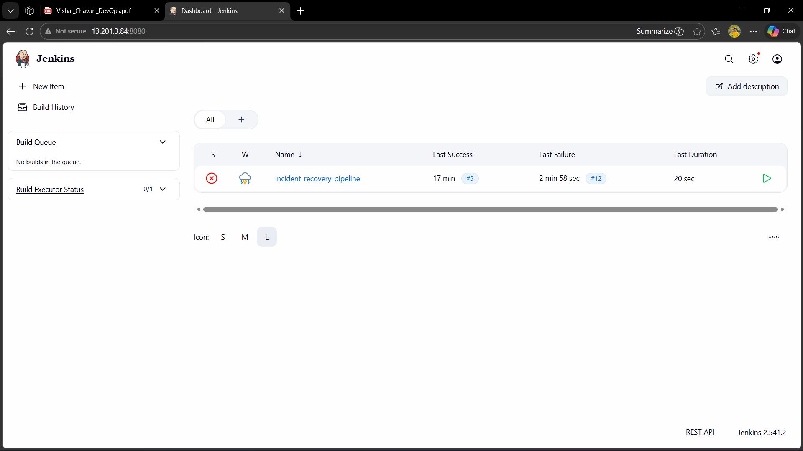

# CI/CD Pipeline using Jenkins and Docker

This project demonstrates a complete Continuous Integration and Continuous Deployment pipeline using Jenkins and Docker.
The main goal of this project is to automatically build, test, containerize and deploy an application whenever new code is pushed to the repository.

Tools used in this project

Jenkins automation server  
Docker container platform  
Source code hosted on :contentReference[oaicite:0]{index=0}  

Core platforms

:contentReference[oaicite:1]{index=1}  
:contentReference[oaicite:2]{index=2}  

---

## Project summary

This project implements a fully automated CI/CD pipeline.

Whenever a developer pushes code to the repository, Jenkins automatically triggers the pipeline.
The pipeline pulls the latest code, builds the application, creates a Docker image and runs the application inside a container.

This setup reduces manual work and ensures faster and more reliable deployments.

---

## Architecture overview

The pipeline consists of the following flow

Developer pushes code to GitHub  
Jenkins detects the change and starts the pipeline  
Jenkins pulls the latest source code  
Application is built inside Jenkins  
A Docker image is created from the application  
The Docker container is started using the newly built image  

---

## Screenshots and explanation

---

### Jenkins dashboard

This screenshot shows the Jenkins home dashboard where all jobs and pipelines are visible.

---

### Jenkins job configuration

This screenshot shows the job configuration page where source code repository and build steps are defined.

---

### GitHub repository integration

This screenshot shows the GitHub repository connected with the Jenkins job.

This is used to fetch the source code for every build.

---

### Webhook configuration in GitHub

This screenshot shows the webhook configuration used to automatically trigger Jenkins whenever new code is pushed.

---

### Jenkins build started after code push

This screenshot confirms that the Jenkins pipeline starts automatically after a new commit is pushed to GitHub.

---

### Jenkins console output

This screenshot shows the live console output of the pipeline execution.

It includes code checkout, build steps and Docker commands.

---

### Docker image build process

This screenshot shows the Docker image being built as part of the Jenkins pipeline.

---

### Docker images list

This screenshot shows the newly created Docker image available on the server.

---

### Running Docker container

This screenshot shows the application running inside a Docker container.

---

### Application output in browser

This screenshot shows the deployed application accessed through the browser after successful pipeline execution.

---

### Successful pipeline completion

This screenshot shows the final successful status of the Jenkins pipeline.

---

## CI CD workflow

A developer pushes the latest code to the GitHub repository.

GitHub webhook notifies Jenkins and triggers the pipeline.

Jenkins pulls the latest source code from the repository.

The application build process is executed.

A Docker image is created using the Dockerfile.

The old container is stopped if it exists.

A new container is started using the latest Docker image.

The updated application becomes available automatically.

---

## Deployment approach

The deployment is container based.

Each new build creates a fresh Docker image.

The application is always deployed using the latest image generated by the pipeline.

This ensures consistency between builds and deployments.

---

## Resume ready description

Designed and implemented an automated CI CD pipeline using Jenkins and Docker.
Integrated GitHub with Jenkins using webhooks to trigger builds automatically.
Containerized the application and deployed it using Docker for faster and reliable delivery.

---

## Author

Vishal Chavan