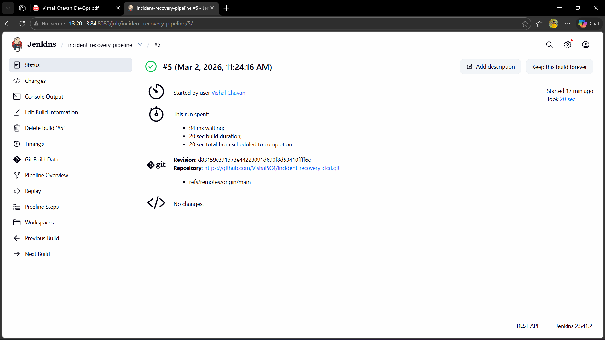
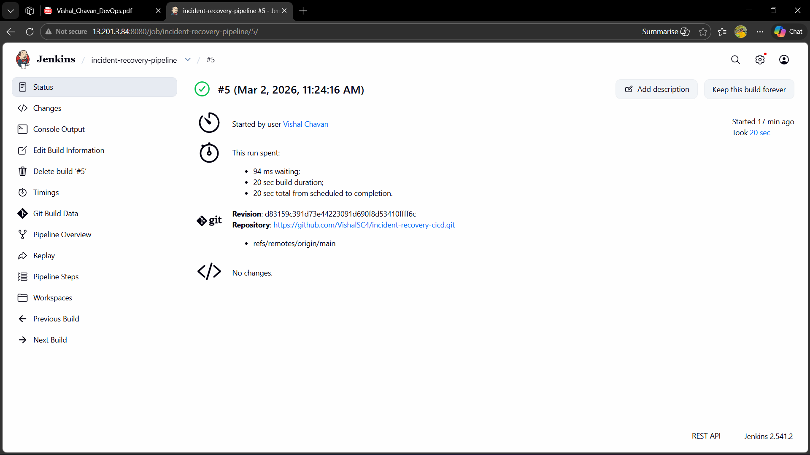
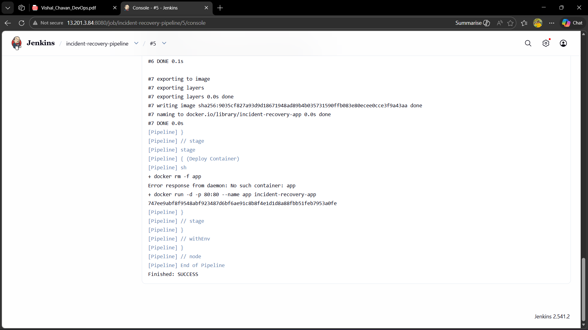
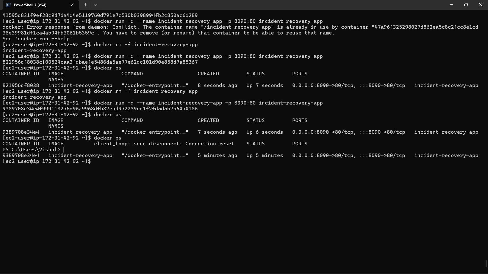
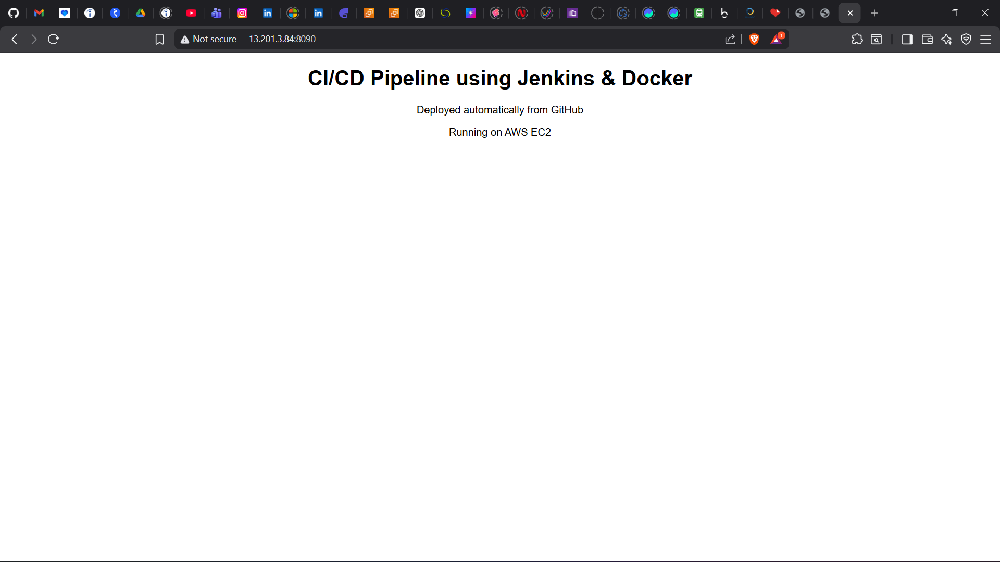
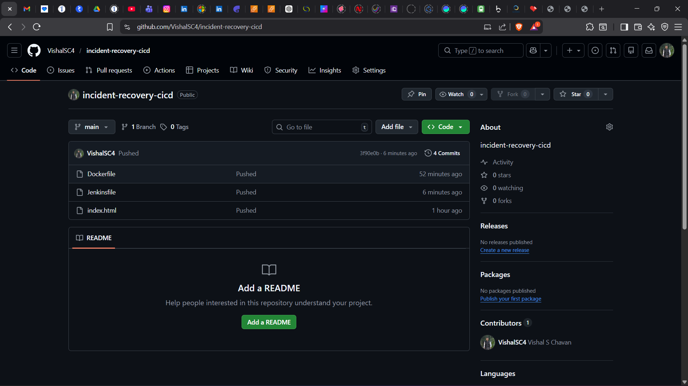

# CI/CD Pipeline using Jenkins and Docker

This project demonstrates a complete Continuous Integration and Continuous Deployment pipeline using Jenkins and Docker.
The main goal of this project is to automatically build, test, containerize and deploy an application whenever new code is pushed to the repository.

Tools used in this project

Jenkins automation server  
Docker container platform  
Source code hosted on GitHub  

Core platforms

Jenkins  
Docker  

---

## Project summary

This project implements a fully automated CI/CD pipeline.

Whenever a developer pushes code to the repository, Jenkins automatically triggers the pipeline.
The pipeline pulls the latest code, builds the application, creates a Docker image and runs the application inside a container.

This setup reduces manual work and ensures faster and more reliable deployments.

---

## Architecture overview

The pipeline consists of the following flow

Developer pushes code to GitHub  
Jenkins detects the change and starts the pipeline  
Jenkins pulls the latest source code  
Application is built inside Jenkins  
A Docker image is created from the application  
The Docker container is started using the newly built image  

---

## Screenshots and explanation

---

### Jenkins dashboard

This screenshot shows the Jenkins home dashboard where the created pipeline job is visible.
It confirms that Jenkins is running correctly and the CI/CD project is configured on the server.

---

### Pipeline configuration

This screenshot shows the pipeline job configuration page.
It includes the GitHub repository details and the pipeline definition used to build and deploy the application using Docker.

---

### Pipeline stage view

This screenshot shows the stage view of the Jenkins pipeline.
Each stage represents an important step such as source code checkout, build, Docker image creation and container deployment.

---

### Build console output

This screenshot shows the live console output of a pipeline execution.
It confirms that the code is pulled from GitHub, the Docker image is built successfully and the container is started without errors.

---

### Docker container running

This screenshot shows the running Docker container on the server.
It verifies that the application container is active and running from the newly built image.

---

### Application running in browser

This screenshot shows the deployed application opened in a web browser.
It confirms that the application is accessible through the server public IP and exposed port.

---

### GitHub repository

This screenshot shows the GitHub repository that contains the application source code and Dockerfile.
This repository is connected to Jenkins and is used as the trigger source for the CI/CD pipeline.

---

## CI CD workflow

A developer pushes the latest code to the GitHub repository.

Jenkins automatically triggers the pipeline.

Jenkins pulls the latest source code.

The application build process is executed.

A Docker image is created using the Dockerfile.

If an old container is running, it is removed.

A new container is started using the latest Docker image.

The updated application becomes available automatically.

---

## Deployment approach

The deployment is completely container based.

Each pipeline run creates a fresh Docker image.

The application is always deployed using the latest image generated by Jenkins.

This ensures consistent and repeatable deployments.

---

## Resume ready description

Designed and implemented an automated CI CD pipeline using Jenkins and Docker.
Configured a Jenkins pipeline connected with a GitHub repository to trigger builds automatically.
Built Docker images and deployed application containers as part of the pipeline to enable fast and reliable delivery.

---

## Author

Vishal Chavan